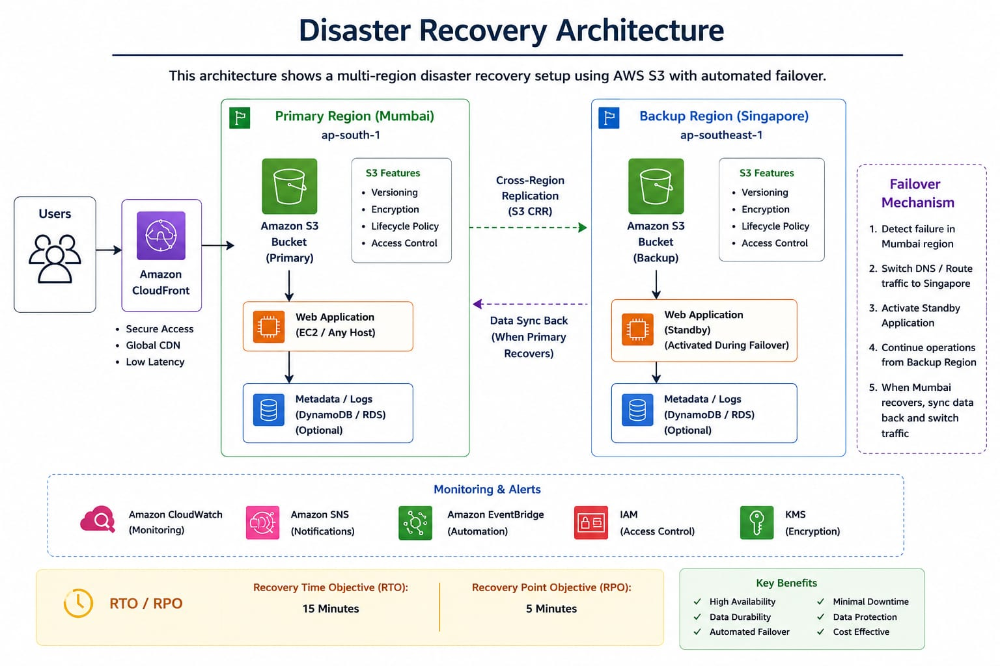

# Cloud Disaster Recovery System

## Objective
Design a cloud disaster recovery solution using AWS S3 with multi-region backup to minimize downtime and data loss.

## Services Used
- Amazon S3
- S3 Versioning
- Multi-Region Storage
- AWS Free Tier

## Project Features
- Primary bucket in Mumbai (ap-south-1)
- Backup bucket in Singapore (ap-southeast-1)
- Bucket versioning enabled
- Multi-region backup
- Disaster recovery failover plan
- RTO/RPO analysis

## Architecture

### Architecture Diagram

### Workflow

Primary Region (Mumbai)
        │
        ▼
Amazon S3 Bucket
        │
 Backup Copy
        ▼
Backup Region (Singapore)
Amazon S3 Bucket
## Conclusion
This project demonstrates a simple disaster recovery system using AWS S3. Data is stored in two regions, reducing the risk of data loss and improving availability during regional failures.
